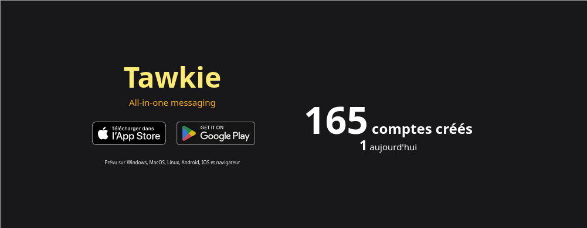

# demo-user-count

Tiny website used as a demo at the French Tech Toulouse 2024 Summer Tech Day at the Tawkie stand. It display the current user count and a call-to-action to download the app.

## Usage

Open `index.html` and edit the constants in the `script` tag at the bottom. The `AUTH_TOKEN` is set in `tawkie-ansible-deploy` when deploying `kratos-panel`.

You can then open `index.html` with Firefox.
